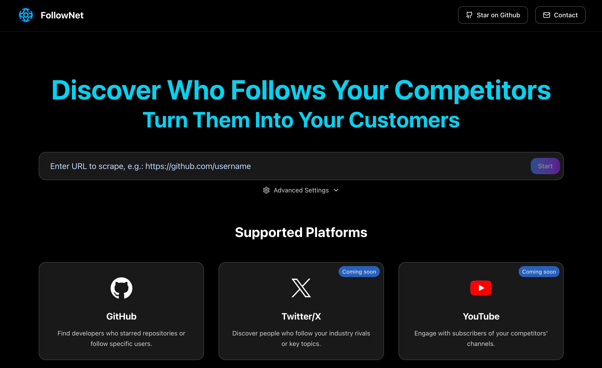

# FollowNet

**Turn your competitors’ followers into your future customers.**  
FollowNet is a powerful tool that scrapes and exports social media follower data, helping you find, engage, and win over audiences who already follow your competitors — so you don’t have to start from scratch.

---

## ✨ Why FollowNet?

🔍 **Find Competitors’ Fans**  
Instantly discover who follows your competitors on platforms like GitHub, Twitter/X, YouTube, and more.

🚀 **Grow Faster**  
Reach out to warm audiences who already have an interest in your niche — no cold starts.

🛠️ **Contribute & Shape the Future**  
We’re building the best competitor analysis tool in the world — and we’d love your help! Whether you’re into web scraping, UI/UX, or platform integrations, your contributions can make a real impact.

---

## 🎯 Features

✅ **Multi-platform Support**  
- GitHub, Twitter/X, Instagram, and more (LinkedIn, YouTube, Reddit coming soon!)

🧠 **Smart URL Detection**  
- Paste any profile or repo URL — we’ll auto-detect the platform.

📥 **Data Export**  
- Export scraped data as CSV for easy integration with your CRM or marketing tools.

⚡ **High Performance**  
- Scrape up to 5,000 users in advanced mode with real-time progress updates.

🎨 **Modern Interface**  
- Built with Next.js + Tailwind CSS for a smooth, intuitive experience.

📊 **Detailed Insights**  
- Collect usernames, bios, follower counts, and more for precise targeting.

---

## 🚦 Supported Platforms & Data

### ✅ GitHub (Available Now)
- Repository stargazers
- User followers
- Extracts: avatar, username, bio, follower count, following count, repositories, and more.

### 🔄 Other Platforms (Planned)
- **Twitter/X**: Followers & following,email
- **Instagram**: Followers & following
- **LinkedIn**: Professional connections
- **YouTube**: Subscriber information
- **Reddit**: Community engagement data

---

## 💡 Want to Contribute?

We welcome PRs for new platform support, performance improvements, UI enhancements, and anything else that can help job-seekers, growth hackers, and sales teams get a competitive edge.  

**Your contributions will directly empower users to discover and engage with the audiences that matter most.**

---

## 📖 License & Contribution Guide

See [CONTRIBUTING.md](./CONTRIBUTING.md) for how to set up your environment and get started.

---

🔥 Let’s make competitor research smarter — together.